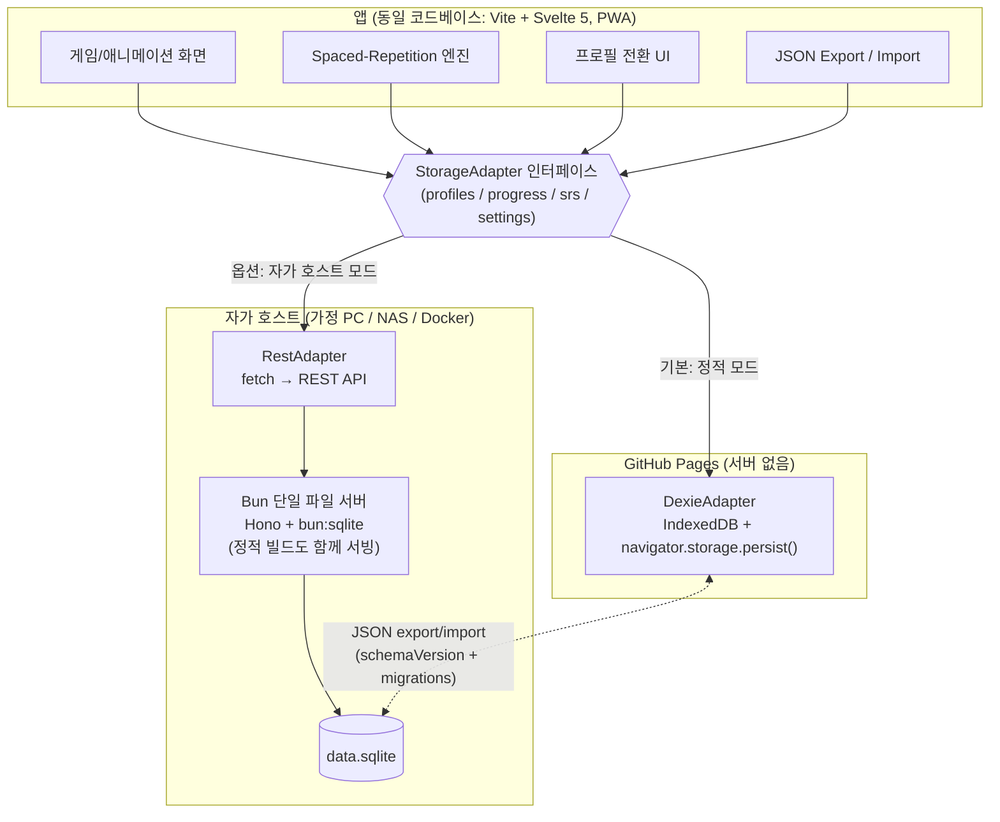

# Mathemagics Interactive — 아키텍처 & 호스팅 리서치

작성일: 2026-07-28 · 조사 방법: 공식 문서(WebKit/MDN/SQLite) + 커뮤니티 1차 소스 웹 검색. 아래 "확인하지 않은 것" 절에 미검증 항목을 명시함.

## 0. 결론 요약 (권장 아키텍처)

- **단일 코드베이스 + `StorageAdapter` 인터페이스**로 저장 백엔드를 교체 가능하게 설계.
- **정적 모드 (GitHub Pages)**: 기본 저장소는 **IndexedDB (Dexie.js)**. localStorage는 "마지막 활성 프로필 ID" 같은 소형 플래그만. `navigator.storage.persist()` 호출 + **PWA 설치 유도**로 Safari ITP 7일 삭제를 방어.
- **자가 호스트 모드 (가족/교실 NAS)**: **Bun 단일 파일 서버 (Hono + `bun:sqlite`)** 가 정적 빌드를 서빙하면서 REST API로 SQLite에 기록. Docker 이미지 옵션 제공.
- **두 모드 사이 이동은 JSON export/import** (스키마 버전 필드 + 순차 마이그레이션 함수 배열)로 해결.
- **프론트엔드: Vite + Svelte 5** (전환/스프링 애니메이션 내장, 번들 소형). **hash routing**으로 Pages 404 문제 회피, `vite-plugin-pwa`로 오프라인 지원, `actions/deploy-pages`로 배포.
- 참고: 공식 SQLite WASM의 `opfs-sahpool` VFS는 **COOP/COEP 없이도 GitHub Pages에서 동작**하지만(§2a), 이 앱의 데이터 규모에서는 Dexie 대비 이점이 없어 기본 채택하지 않음.



ASCII 버전:

```
                ┌────────────────────────────────────────────┐
                │  앱 (Vite + Svelte 5, PWA, hash routing)   │
                │  게임 · SRS 엔진 · 프로필 · export/import  │
                └───────────────────┬────────────────────────┘
                                    │
                      StorageAdapter (인터페이스)
                     ┌──────────────┴──────────────┐
        [정적 모드: GitHub Pages]        [자가 호스트 모드: NAS/Docker]
        DexieAdapter                     RestAdapter ──HTTP──▶ Bun 서버
        (IndexedDB + persist())                        (Hono + bun:sqlite)
              │                                              │
              └────────── JSON export/import ────────── data.sqlite
                       (schemaVersion + migrations)
```

---

## 1. 저장소 추상화 (Storage Abstraction)

### 1.1 디자인 패턴

고전적 **Repository / Adapter 패턴**이면 충분하다. 도메인별 저장 API를 하나의 인터페이스로 묶고, 구현체(DexieAdapter, RestAdapter)를 앱 부팅 시 주입한다. 비동기 백엔드(REST)를 지원해야 하므로 **모든 메서드는 처음부터 `Promise` 기반**으로 설계한다 — localStorage처럼 동기인 백엔드 때문에 동기 API를 만들면 나중에 REST로 못 갈아탄다.

```typescript
// src/storage/types.ts — 인터페이스 스케치

export interface Profile {
  id: string;            // uuid
  name: string;
  avatar: string;        // 이모지 or 에셋 키
  createdAt: number;     // epoch ms
}

export interface ProgressRecord {
  profileId: string;
  skillId: string;       // 예: "add-within-10"
  attempts: number;
  correct: number;
  lastPlayedAt: number;
  stars: 0 | 1 | 2 | 3;
}

// SM-2 / FSRS 계열 spaced-repetition 상태
export interface SrsCard {
  profileId: string;
  factId: string;        // 예: "7x8"
  due: number;           // epoch ms
  stability: number;
  difficulty: number;
  reps: number;
  lapses: number;
  lastReview: number;
}

export interface Settings {
  profileId: string;     // 프로필별 설정
  soundOn: boolean;
  locale: string;
  dailyGoalMinutes: number;
}

export interface ExportBundle {
  schemaVersion: number;           // §3 마이그레이션의 기준
  exportedAt: number;
  app: "mathemagics";
  profiles: Profile[];
  progress: ProgressRecord[];
  srsCards: SrsCard[];
  settings: Settings[];
}

export interface StorageAdapter {
  init(): Promise<void>;

  // profiles
  listProfiles(): Promise<Profile[]>;
  upsertProfile(p: Profile): Promise<void>;
  deleteProfile(id: string): Promise<void>;      // cascade: progress/srs/settings

  // progress
  getProgress(profileId: string): Promise<ProgressRecord[]>;
  upsertProgress(r: ProgressRecord): Promise<void>;

  // spaced repetition
  getDueCards(profileId: string, now: number, limit: number): Promise<SrsCard[]>;
  upsertCard(c: SrsCard): Promise<void>;

  // settings
  getSettings(profileId: string): Promise<Settings | undefined>;
  saveSettings(s: Settings): Promise<void>;

  // portability (§3)
  exportAll(): Promise<ExportBundle>;
  importAll(bundle: ExportBundle, mode: "merge" | "replace"): Promise<void>;
}
```

어댑터 선택은 빌드 타임 플래그가 아니라 **런타임 감지**로 한다(같은 정적 빌드를 두 모드에서 재사용하기 위해). 예: 서버 모드에서는 Bun 서버가 `/api/health`를 서빙하므로 부팅 시 한 번 probe → 성공하면 RestAdapter, 실패(GitHub Pages)하면 DexieAdapter.

```typescript
export async function createAdapter(): Promise<StorageAdapter> {
  try {
    const r = await fetch("/api/health", { signal: AbortSignal.timeout(800) });
    if (r.ok) return new RestAdapter();
  } catch { /* 정적 호스팅 → 로컬 저장 */ }
  return new DexieAdapter();
}
```

### 1.2 localStorage vs IndexedDB — 성장하는 진도 데이터에는 IndexedDB

| 항목 | localStorage | IndexedDB (Dexie/idb) |
|---|---|---|
| 용량 | 관례상 ~5MB, 문자열만 | Chrome: 디스크의 최대 60%/origin, Firefox: 그룹당 ~10GiB(영구 저장 승인 시 그 이상), Safari: ~1GB 시작 후 200MB 단위 사용자 승인 확대 ([MDN](https://developer.mozilla.org/en-US/docs/Web/API/Storage_API/Storage_quotas_and_eviction_criteria)) |
| API | 동기(메인 스레드 블로킹) — 애니메이션 프레임 드랍 위험 | 비동기, 인덱스 쿼리("due ≤ now인 카드" 같은 SRS 질의에 필수) |
| 구조화 | JSON.stringify 수동 직렬화 | 객체 저장 + 복합 인덱스 + 트랜잭션 |
| 스키마 버전 | 없음(직접 구현) | Dexie `version(n).stores(...)` 업그레이드 내장 |
| 삭제/축출(eviction) | Safari ITP 7일 규칙 동일 적용 | 동일 적용. 단 `persist()` 승격 가능 |

SRS 카드는 프로필당 수백~수천 행으로 자라고(구구단만 해도 100+ fact × 이력), "지금 복습할 카드" 인덱스 질의가 핵심이므로 **IndexedDB가 정답**이다. 라이브러리는 **Dexie.js**(2026년 기준 v4.x, 주간 다운로드 ~150만, 타입드 테이블·스키마 버저닝 내장 — [비교 가이드](https://www.pkgpulse.com/guides/dexie-vs-localforage-vs-idb-indexeddb-browser-storage-2026)) 권장. 더 얇게 가려면 `idb`(래퍼만, ~1KB)도 가능하지만 스키마 버저닝을 직접 짜야 한다.

### 1.3 2026년 쿼터/축출 현실 — Safari ITP가 최대 리스크

- **Safari ITP 7일 캡은 여전히 유효**: 사용자가 해당 사이트에 **7일간(사용일 기준) 상호작용하지 않으면** localStorage·IndexedDB·Service Worker 등록을 포함한 모든 script-writable storage를 삭제한다. iOS에서는 모든 브라우저가 WebKit이므로 iPhone/iPad 전체에 해당 ([WebKit Tracking Prevention](https://webkit.org/tracking-prevention/), [WebKit Full Third-Party Cookie Blocking](https://webkit.org/blog/10218/full-third-party-cookie-blocking-and-more/)).
- **공식 면제 경로는 홈 화면 추가(PWA)**: 홈 화면 웹앱의 1st-party 도메인은 7일 캡에서 면제된다고 WebKit이 명시 ([WebKit Tracking Prevention Policy](https://webkit.org/tracking-prevention/)). → **아이들 앱은 어차피 홈 화면 아이콘이 UX상 자연스러우므로, "홈 화면에 추가" 안내를 1급 온보딩 요소로 넣는 것이 실질적 방어책.**
- **`navigator.storage.persist()`**: Chrome은 PWA 설치/북마크/사용 이력 기반 자동 승인, Firefox는 사용자 프롬프트, Safari는 휴리스틱(홈 화면 앱 여부 등) 기반 ([WebKit Updates to Storage Policy](https://webkit.org/blog/14403/updates-to-storage-policy/), [Dexie StorageManager 문서](https://dexie.org/docs/StorageManager)). persist 승인이 ITP 7일 타이머를 확실히 이긴다는 **공식 문서는 없다** — 실무 보고는 "보호되는 것 같다" 수준 ([Apple Dev Forums](https://developer.apple.com/forums/thread/710157)). 호출 비용이 없으므로 부팅 시 항상 호출하되, 유일한 방어선으로 삼지 말 것.
- **기본은 best-effort 저장**: 축출 시 origin 데이터가 **통째로**(부분 아님) 삭제된다 ([MDN](https://developer.mozilla.org/en-US/docs/Web/API/Storage_API/Storage_quotas_and_eviction_criteria)). → 대응: (1) persist() 요청, (2) PWA 설치 유도, (3) **주기적 JSON export 리마인더**("진도 백업하기" 버튼 — 부모용), (4) 자가 호스트 모드 제공 자체가 근본 해결책.

---

## 2. SQLite 옵션 평가 (자가 호스트 모드)

### 2a. 공식 SQLite WASM + OPFS — "GitHub Pages에서도 되는가?" → **VFS에 따라 다름 (중요)**

- 공식 `@sqlite.org/sqlite-wasm`의 **`opfs` VFS**는 SharedArrayBuffer + Atomics를 쓰므로 **COOP/COEP 헤더 → `crossOriginIsolated` 필수**. GitHub Pages는 커스텀 헤더를 지원하지 않으므로(공식 기능 요청만 걸려 있고 "No ETA" — [GitHub Community #13309](https://github.com/orgs/community/discussions/13309)) 이 VFS는 Pages에서 불가.
- 그러나 **`opfs-sahpool` VFS (SQLite 3.43+)는 COOP/COEP가 필요 없다.** SQLite 공식 persistence 문서가 "헤더를 설정할 수 없는 클라이언트는 opfs-sahpool을 쓰라"고 명시하며, 성능도 셋 중 가장 좋다. 제약: **단일 커넥션·탭 간 동시성 없음**, OPFS 내부 파일명이 불투명함 ([SQLite Persistence 문서](https://sqlite.org/wasm/doc/trunk/persistence.md), [SQLite Forum — GitHub Pages 사례](https://www3.sqlite.org/cgi/forum/info/3b7ca2d0221e0a2a3010b83b1d4d80c6529b782089c3658e56859ef6cc4231d0)).
- **coi-serviceworker** ([gzuidhof/coi-serviceworker](https://github.com/gzuidhof/coi-serviceworker))로 Pages에서 COOP/COEP를 서비스 워커로 주입하는 우회도 가능하지만: 첫 로드 시 강제 리로드, 번들 금지(별도 파일·자기 origin 서빙), 사설 모드에서 실패, 다른 SW(PWA용 Workbox!)와 충돌 보고 ([Thomas Steiner 블로그](https://blog.tomayac.com/2025/03/08/setting-coop-coep-headers-on-static-hosting-like-github-pages/), [Wasmer 가이드](https://docs.wasmer.io/sdk/wasmer-js/how-to/coop-coep-headers/)). **PWA를 쓰는 본 앱과 궁합이 나빠 비권장.**
- 추가 주의: 공식 WASM의 Worker1/Promiser API는 2026-04-15부로 deprecated ("non-toy 소프트웨어에 너무 취약/저성능") — 쓴다면 OO1 API 직접 사용 또는 [birchill/nice-sqlite-wasm](https://github.com/birchill/nice-sqlite-wasm/) 같은 sahpool 전용 빌드 ([sqlite-wasm npm](https://www.npmjs.com/package/@sqlite.org/sqlite-wasm)).

**정직한 평가**: opfs-sahpool 덕분에 "브라우저 로컬 SQLite"는 GitHub Pages에서도 기술적으로 가능하다. 하지만 그것은 여전히 **그 브라우저·그 기기 안의 데이터**라서 ITP 축출 리스크와 기기 종속 문제를 하나도 해결하지 못한다. 즉 정적 모드에서 Dexie 대신 채택할 이유가 없고(SQL이 꼭 필요한 데이터 모양이 아님, +~1MB WASM 로드), **자가 호스트 모드의 목적(가족 공용 중앙 데이터, 실백업)에도 부합하지 않는다.** → 채택하지 않되, 문서에 "가능함"을 기록해 둠.

### 2b. 초소형 자가 호스트 서버 (권장) — Bun 단일 파일 + Hono + `bun:sqlite`

- **구성**: `server.ts` 단일 파일. Hono 라우터로 (1) `dist/` 정적 서빙, (2) `/api/*` REST(StorageAdapter 메서드와 1:1 대응 — 엔드포인트 ~10개), (3) `/api/health`. Bun 내장 `bun:sqlite`는 better-sqlite3 계열 동기 API라 별도 네이티브 빌드가 없다. `bun build --compile`로 **의존성 없는 단일 실행 파일** 배포도 가능. Node 선호 시 better-sqlite3 + Hono로 동일 구조([2026 비교](https://www.pkgpulse.com/guides/better-sqlite3-vs-libsql-vs-sql-js-sqlite-nodejs-2026): 서버 사이드는 better-sqlite3 계열이 표준).
- **Docker**: `oven/bun` 공식 이미지 + 볼륨 마운트(`/data/data.sqlite`) — NAS(Synology 등) 사용자에게 가장 익숙한 설치 경로.
- **노력**: REST 핸들러 + SQL 스키마 4테이블 + Dockerfile ≈ 200~400줄. 인증은 LAN 전용 가정 하에 생략 가능(프로필 PIN은 앱 레벨, §5).
- **효익**: 기기 간 공유(아이패드+PC), 브라우저 축출과 무관한 진짜 영속성, `data.sqlite` 파일 복사만으로 백업, 교실 단위 다계정.

### 2c. sql.js 인메모리 + 파일 export/import

- sql.js는 유지보수 활발(주간 646K 다운로드, [Snyk Healthy 등급](https://security.snyk.io/package/npm/sql.js))하고 `db.export()` → `Uint8Array` 왕복이 강점 ([sql.js repo](https://github.com/sql-js/sql.js/)). 그러나 **인메모리라 새로고침에 전부 증발** — 결국 IndexedDB에 스냅숏을 저장해야 하는데, 그럴 바에 처음부터 Dexie가 낫다. WASM ~1.5MB 로드도 부담. **비권장** (SQLite 파일을 "읽기 전용 데이터 포맷"으로 배포할 때나 적합).

### 트레이드오프 표

| 옵션 | GitHub Pages 동작 | 영속성 | 기기 간 공유 | 구현 노력 | 판정 |
|---|---|---|---|---|---|
| Dexie (IndexedDB) | O | 브라우저 관리(persist+PWA로 보강) | X | 낮음 | **정적 모드 기본** |
| SQLite WASM `opfs` VFS | X (COOP/COEP 불가) | 브라우저 관리 | X | 중 | 탈락 |
| SQLite WASM `opfs-sahpool` | **O (헤더 불필요)** | 브라우저 관리 (ITP 동일 적용) | X | 중 (+1MB WASM) | 가능하나 이점 없음 |
| coi-serviceworker 우회 | △ (리로드·SW 충돌) | 브라우저 관리 | X | 중 | PWA와 충돌, 비권장 |
| sql.js + 파일 export | O | 수동(사용자가 파일 관리) | 수동 | 중 | 비권장 |
| **Bun/Hono + bun:sqlite 서버** | 해당 없음 (자가 호스트) | **서버 파일 (진짜 영속)** | **O (LAN)** | 중 (~300줄+Docker) | **자가 호스트 모드 채택** |

---

## 3. 데이터 이식성 (Portability)

### 3.1 JSON 번들 = 두 모드의 공용 통화

§1.1의 `ExportBundle`이 유일한 교환 포맷. localStorage↔SQLite 직접 변환은 만들지 않는다 — 각 어댑터가 `exportAll()`/`importAll()`만 구현하면 어떤 방향 이동도 `export → 파일 다운로드 → import`로 끝난다. 자가 호스트 서버도 같은 번들을 `GET /api/export`, `POST /api/import`로 노출(교실 → 가정 이동, 서버 백업 겸용).

`importAll(bundle, "merge")`의 병합 규칙: 프로필은 `id` 기준 upsert, progress/srs는 `(profileId, skillId|factId)` 기준으로 **`lastPlayedAt`/`lastReview`가 최신인 쪽 승리** (last-write-wins). 형제가 두 기기에서 각자 쓰다 합치는 시나리오까지 커버.

### 3.2 스키마 버저닝/마이그레이션 패턴

번들에 `schemaVersion: number`를 박고, **순차 마이그레이션 함수 배열** 하나를 코어에 둔다. Dexie의 `version(n).upgrade()`와 SQLite의 `PRAGMA user_version` 마이그레이션이 각각 존재하더라도, **JSON 번들 마이그레이션은 어댑터와 무관하게 공용 코드 1곳**에서 수행 → import 시 `bundle.schemaVersion`부터 현재 버전까지 차례로 적용.

```typescript
// src/storage/migrations.ts
type Migration = (raw: any) => any;   // vN 번들 → vN+1 번들
export const CURRENT_SCHEMA = 3;
const migrations: Record<number, Migration> = {
  1: (b) => ({ ...b, srsCards: b.srsCards ?? [] }),          // v1→v2
  2: (b) => ({ ...b, settings: normalizeSettings(b) }),      // v2→v3
};
export function migrate(bundle: any): ExportBundle {
  let v = bundle.schemaVersion ?? 1;
  while (v < CURRENT_SCHEMA) { bundle = migrations[v](bundle); v++; }
  return { ...bundle, schemaVersion: CURRENT_SCHEMA };
}
```

원칙: (1) 마이그레이션은 앞으로만(다운그레이드 없음, 대신 export 파일에 버전이 있으니 구버전 앱이 신버전 번들을 만나면 명확히 거부), (2) 필드 추가는 optional + 기본값으로 흡수해 마이그레이션 수 최소화, (3) SQLite 쪽 DDL 마이그레이션도 같은 버전 번호에 맞춰 `user_version`으로 관리.

---

## 4. 프론트엔드 스택 (GitHub Pages, 2026)

### 4.1 프레임워크: **Vite + Svelte 5** 권장

| | React 19 | **Svelte 5** | Solid | Vanilla |
|---|---|---|---|---|
| 런타임 크기 | ~42KB+ | **~2–5KB** | ~7KB | 0 |
| 애니메이션 | 외부 라이브러리(Framer Motion 등) | **transition/spring/tween 내장** | 외부 | 전부 수제 |
| 반응성 모델 | 훅/컴파일러 | runes(신호 기반, v5 안정) | 신호 | — |
| 생태계/인력 | 최대 | 충분 | 작음 | — |

아이 대상 앱은 화면마다 전환·스프링·별 파티클이 들어가는데 Svelte는 이를 **의존성 0으로 내장**하고, 저사양 태블릿에서 유리한 최소 번들을 준다. 개인/가족 프로젝트라 React 생태계 이점(팀 채용 등)이 무의미하므로 Svelte 5 선택이 합리적 ([Svelte transitions 가이드](https://ahmedsuliman.medium.com/svelte-transitions-and-animations-a-comprehensive-guide-89793e0b7e88)). Solid도 좋지만 애니메이션 내장이 없어 차별점이 약함. 캔버스 위주 미니게임이 커지면 해당 화면만 PixiJS 등을 부분 도입.

### 4.2 라우팅: **hash routing** (`/#/game/addition`)

GitHub Pages는 SPA 폴백이 없어 BrowserRouter 딥링크가 404가 난다. `404.html` 리다이렉트 트릭(spa-github-pages)도 있지만 리다이렉트 깜빡임 + 크롤러 이슈가 있고, 아이용 앱은 딥링크 SEO가 필요 없으므로 **hash routing이 가장 단순·견고**. Svelte에선 `svelte-spa-router` 또는 자체 해시 스토어면 충분.

### 4.3 PWA/오프라인: `vite-plugin-pwa`

- Workbox 기반 프리캐시로 **완전 오프라인 실행**(수학 앱은 네트워크 자산이 없음).
- Safari ITP 방어(§1.3)와 겹치는 이중 효익: **홈 화면 설치가 곧 데이터 보존 정책**.
- 주의: 자가 호스트 모드에서 `/api/*`는 `NetworkOnly` 라우팅으로 SW 캐시에서 제외. `base` 경로(`/repo-name/`)를 Vite `base` 설정과 manifest `scope`에 일치시킬 것.

### 4.4 배포: GitHub Actions → `actions/deploy-pages`

`gh-pages` 브랜치 커밋 방식 대신 공식 아티팩트 방식: push → `bun run build` → `actions/upload-pages-artifact`(dist) → `actions/deploy-pages`. Settings에서 Source를 "GitHub Actions"로 설정. 워크플로 ~30줄.

---

## 5. 멀티 프로필 (형제 공용 기기)

- **데이터 모델은 이미 프로필 중심**(§1.1 — 모든 레코드에 `profileId`). 두 모드 공통.
- **정적 모드**: 프로필 선택 화면(아바타 그리드)이 첫 화면. `localStorage["lastProfileId"]`로 마지막 사용자 자동 선택. 같은 브라우저 프로필 안에서는 형제 데이터가 한 IndexedDB에 공존 — 보안이 아니라 **혼동 방지**가 목표이므로 삭제 같은 파괴적 행위에만 "부모 게이트"(간단한 곱셈 문제 or PIN).
- **자가 호스트 모드**: 프로필이 서버 DB에 있으므로 **기기가 달라도 동일 프로필 목록**이 뜬다(이 모드의 핵심 가치). 교실 규모면 프로필당 4자리 PIN(앱 레벨, `settings`에 해시 저장)으로 가벼운 잠금. LAN 밖 노출을 지원하지 않는다고 문서화(인증/HTTPS는 스코프 외 — 필요 시 Tailscale 안내).
- Export 번들은 프로필 배열을 통째로 담으므로, "동생 것만 옮기기"는 v1 스코프에서 제외하고 전체 병합(§3.1 규칙)으로 처리.

---

## 확인하지 않은 것 / 리스크

- `navigator.storage.persist()`가 Safari ITP 7일 타이머를 이기는지는 **공식 확인 불가**(실무 보고만 존재) — 그래서 PWA 설치 유도를 주 방어선으로 삼음.
- Bun `bun:sqlite`의 세부 API 안정성은 문서 수준으로만 확인(직접 벤치마크 안 함). Node+better-sqlite3 대체가 항상 가능.
- Svelte 5 runes와 `svelte-spa-router` 호환의 최신 상태는 착수 시 재확인 필요.
- GitHub Pages 커스텀 헤더 지원은 "No ETA" 상태 — 향후 지원되면 §2a 판단 재검토 가치 있음.

## 소스

- SQLite WASM 영속성/VFS: https://sqlite.org/wasm/doc/trunk/persistence.md · https://www3.sqlite.org/cgi/forum/info/3b7ca2d0221e0a2a3010b83b1d4d80c6529b782089c3658e56859ef6cc4231d0 · https://www.npmjs.com/package/@sqlite.org/sqlite-wasm · https://github.com/birchill/nice-sqlite-wasm/
- Safari ITP / 저장 정책: https://webkit.org/tracking-prevention/ · https://webkit.org/blog/14403/updates-to-storage-policy/ · https://webkit.org/blog/10218/full-third-party-cookie-blocking-and-more/ · https://developer.apple.com/forums/thread/710157
- 쿼터/축출/Dexie: https://developer.mozilla.org/en-US/docs/Web/API/Storage_API/Storage_quotas_and_eviction_criteria · https://dexie.org/docs/StorageManager · https://www.pkgpulse.com/guides/dexie-vs-localforage-vs-idb-indexeddb-browser-storage-2026 · https://github.com/matrix-org/matrix-js-sdk/blob/develop/docs/storage-notes.md
- COOP/COEP·GitHub Pages: https://github.com/orgs/community/discussions/13309 · https://github.com/gzuidhof/coi-serviceworker · https://blog.tomayac.com/2025/03/08/setting-coop-coep-headers-on-static-hosting-like-github-pages/ · https://docs.wasmer.io/sdk/wasmer-js/how-to/coop-coep-headers/
- sql.js / 서버 SQLite: https://github.com/sql-js/sql.js/ · https://security.snyk.io/package/npm/sql.js · https://www.pkgpulse.com/guides/better-sqlite3-vs-libsql-vs-sql-js-sqlite-nodejs-2026 · https://developer.chrome.com/blog/from-web-sql-to-sqlite-wasm
- 프론트엔드: https://ahmedsuliman.medium.com/svelte-transitions-and-animations-a-comprehensive-guide-89793e0b7e88
